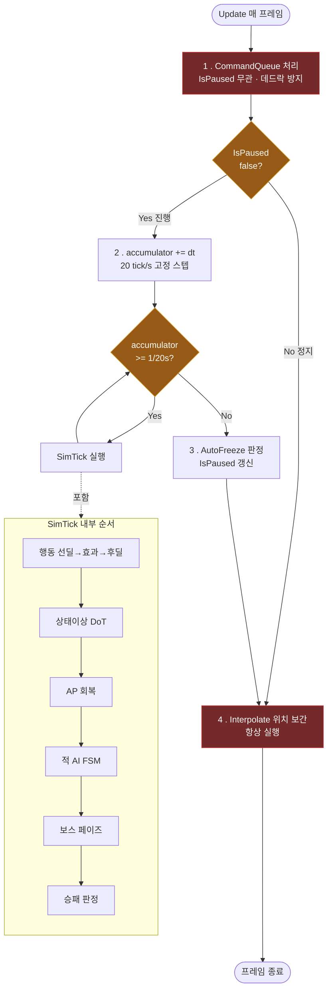

# RTwP 전투 루프 (Real-Time with Pause)

```mermaid
flowchart TD
    Start([Update 매 프레임]) --> CQ[1 . CommandQueue 처리<br/>IsPaused 무관 · 데드락 방지]
    CQ --> Check{IsPaused<br/>false?}
    Check -->|Yes 진행| Acc[2 . accumulator += dt<br/>20 tick/s 고정 스텝]
    Check -->|No 정지| Interp
    Acc --> Loop{accumulator<br/>>= 1/20s?}
    Loop -->|Yes| Tick[SimTick 실행]
    Tick --> Loop
    Loop -->|No| Freeze
    Freeze[3 . AutoFreeze 판정<br/>IsPaused 갱신] --> Interp[4 . Interpolate 위치 보간<br/>항상 실행]
    Interp --> End([프레임 종료])

    subgraph SimTickDetail["SimTick 내부 순서"]
        direction TB
        T1[행동 선딜→효과→후딜] --> T2[상태이상 DoT]
        T2 --> T3[AP 회복]
        T3 --> T4[적 AI FSM]
        T4 --> T5[보스 페이즈]
        T5 --> T6[승패 판정]
    end

    Tick -.포함.-> SimTickDetail

    classDef always fill:#742a2a,stroke:#c53030,color:#fff
    classDef cond fill:#975a16,stroke:#d69e2e,color:#fff
    class CQ,Interp always
    class Check,Loop cond
```
