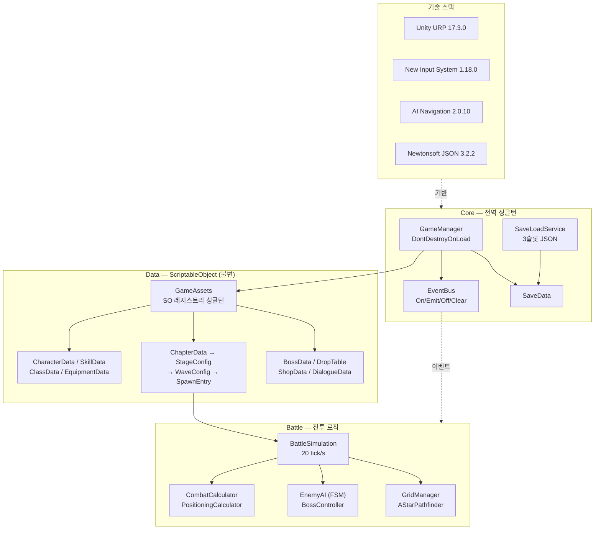

# RTwP RPG — 전체 시스템 개요

> 소스: `architecture.md` 기준 / 최종 정리: 2026-06-01

---

## 전체 시스템 개요

```mermaid
graph TB
    subgraph TECH["기술 스택"]
        URP["Unity URP 17.3.0"]
        INPUT["New Input System 1.18.0"]
        NAV["AI Navigation 2.0.10"]
        JSON["Newtonsoft JSON 3.2.2"]
    end

    subgraph CORE["Core — 전역 싱글턴"]
        GM["GameManager<br/>DontDestroyOnLoad"]
        EB["EventBus<br/>On/Emit/Off/Clear"]
        SLS["SaveLoadService<br/>3슬롯 JSON"]
        SD["SaveData"]
    end

    subgraph DATA["Data — ScriptableObject (불변)"]
        GA["GameAssets<br/>SO 레지스트리 싱글턴"]
        CHAR["CharacterData / SkillData<br/>ClassData / EquipmentData"]
        CHAP["ChapterData → StageConfig<br/>→ WaveConfig → SpawnEntry"]
        BOSS["BossData / DropTable<br/>ShopData / DialogueData"]
    end

    subgraph BATTLE["Battle — 전투 로직"]
        SIM["BattleSimulation<br/>20 tick/s"]
        COMBAT["CombatCalculator<br/>PositioningCalculator"]
        AI["EnemyAI (FSM)<br/>BossController"]
        GRID["GridManager<br/>AStarPathfinder"]
    end

    GM --> SD
    GM --> EB
    GM --> GA
    SLS --> SD
    GA --> CHAR
    GA --> CHAP
    GA --> BOSS
    SIM --> COMBAT
    SIM --> AI
    SIM --> GRID
    CHAP --> SIM
    EB -.이벤트.-> BATTLE
    TECH -.기반.-> CORE
```
